# VRTANS — Design System & Page Architecture (design.md)

## Executive Summary & Design Philosophy

**VRTANS** is an enterprise technology consulting and executive advisory platform engineered for C-Suite technology leaders (CIOs, CTOs, CISOs, and Heads of Infrastructure). The platform's visual identity balances **high-density technical rigor** with **executive elegance**, intentionally contrasting against traditional, generic corporate templates.

### Core Positioning
- **Senior Practitioner Model**: Engagements are architected and delivered exclusively by senior practice leads. Zero junior pass-throughs or layered consultancy bloat.
- **Fiercely Independent Counsel**: Vendor-agnostic architecture across AWS, Azure, GCP, and open-source stacks.
- **Audited Outcome Accountability**: Program milestones bound directly to audited financial savings, uptime SLAs, and latency metrics.
- **Strategy Through Code**: Complete end-to-end delivery from board-level reference architecture to production deployment and compliance sign-off.

---

## 1. Design Language & Design System Architecture

### 1.1 Color Palette & Theme Engine

The application utilizes a **Dual-Theme High-Contrast Architectural Design System**, dynamically balancing an **Executive High-Contrast Dark Engine** for technical depth and a **Warm Editorial Beige Engine** for readable case studies and advisory briefs.

| Token Name | HSL / Hex Code | CSS Variable | Purpose & Usage |
| :--- | :--- | :--- | :--- |
| **Executive Black** | `#000000` / `0 0% 0%` | `--background` (Dark) | Primary background for hero sections, headers, and top-level navigation. |
| **Panel Surface** | `#090b0f` / `220 25% 4%` | `--surface` (Dark) | Dark card containers, mobile navigation drawer background. |
| **Rail Grey** | `#1a1a1a` / `0 0% 10%` | `--iv-rail` | Card borders, dividers, subtle hover backgrounds in dark mode. |
| **Warm Editorial Beige**| `#faf7f2` / `0 0% 98%` | `--surface` (Light) | Warm cream background for readable content, capability grids, and forms. |
| **Warm Card Border** | `#e5dccf` / `0 0% 88%` | `--border` (Light) | Subtle warm borders framing content cards and form elements. |
| **VRTANS Accent Green**| `#86bc25` / `82 52% 44%` | `--accent` / `--ring` | Primary brand accent color; used for active highlights, focus rings, and badge indicators. |
| **Deep Sapphire Blue** | `#080d1a` / `#0b1830` | Custom utility | Background for whitepaper/research sections, culture pillars, and deep technical features. |
| **Brand Gradient Logo**| `linear-gradient(90deg, #ef4444 0%, #ec4899 50%, #a855f7 100%)` | `.hover-VRTANS-border` | Signature brand gradient used in hover borders, logo text, and section divider rails. |

---

### 1.2 Typography System

The typography is built around a hybrid pair of Google Fonts loaded via Next.js Font Optimization:

- **Primary Body & Interface**: `Open Sans` & `Inter` (Sans-Serif)
  - Light (`300`) for body copy and editorial paragraphs.
  - Normal (`400`) & Medium (`500`) for navigation links and descriptions.
  - SemiBold (`600`) & Bold (`700`) for section titles, metrics, and interactive buttons.
  - Letter spacing: Tight `-0.02em` tracking with font feature settings (`ss01`, `cv11`).
- **Editorial Headlines**: `Instrument Serif` (Serif)
  - Regular (`400`) italic styling for high-impact hero headings and audited case study statements.

```css
/* Typography Token Utility */
body {
  font-family: 'Open Sans', 'Inter', -apple-system, BlinkMacSystemFont, sans-serif;
  font-weight: 300;
  line-height: 1.35;
  letter-spacing: -0.02em;
}

.font-serif {
  font-family: 'Instrument Serif', 'Times New Roman', serif;
  font-weight: 400;
  letter-spacing: -0.02em;
}
```

---

### 1.3 Component Mechanics & Visual Utilities

1. **Hover VRTANS Border (`.hover-VRTANS-border`)**:
   - A custom CSS pseudo-element utility that projects a multi-color gradient boundary (`#ef4444` → `#ec4899` → `#a855f7`) on hover while keeping the interior background clean.
2. **Metallic Texture CTA Buttons**:
   - High-contrast action buttons featuring a subtle metallic background texture (`/images/metallic_bg.png`) combined with bold text and smooth hover scale effects.
3. **Interactive 3D Cobe Globe (`InteractiveGlobe`)**:
   - WebGL 3D globe rendered on an HTML `<canvas>` with custom marker points across global financial hubs (New York, London, Frankfurt, Dubai, Singapore, Tokyo).
4. **3D Rotating Testimonial Wheel (`RotatingTestimonials`)**:
   - Interactive 3D carousel using Framer Motion 3D perspective transforms (`rotateY`, `scale`, `z-index`, `translate3d`). Supports smooth 2.5s auto-rotation, hover pause, and manual prev/next navigation.
5. **Shutter Consultation Widget (`ConsultationWidget`)**:
   - A floating fixed action button in the bottom-right corner that expands smoothly into a quick advisory menu (Schedule call, request whitepapers, email partners).

---

## 2. Global Layout & Structural Components

### 2.1 Sticky Executive Header (`Nav`)
- **Location**: `components/site/nav.js`
- **Behavior**: Sticky header with dynamic background blur and shadow transition on scroll.
- **Brand Mark**: `Logo` component featuring dynamic SVG text gradient (`VRTANS`) paired with clean "Technologies" typography.
- **Navigation Links**:
  - **Who We Are** (Mega-menu dropdown)
  - **What We Do** (Mega-menu dropdown)
  - **Industries** (Mega-menu dropdown)
  - **Our Work** (Mega-menu dropdown)
  - **Careers** (Direct link)
- **Mega-Menu Panel Architecture**:
  - **Column 1 (Left 25%)**: Category Lead Title & Sub-practice links with dedicated icons.
  - **Column 2 (Center 42%)**: Capabilities grid with 2-column list of sub-pages and descriptions.
  - **Column 3 (Right 33%)**: Featured Spotlight card with background image overlay and direct CTA link.
- **Mobile Drawer**: Slide-over drawer overlay for viewports under `1024px` with expandable sub-menus and mobile CTA button.

---

### 2.2 Global Footer (`Footer`)
- **Location**: `components/site/footer.js`
- **Style**: Executive Deep Black (`#000000`) with subtle top border (`#1a1a1a`).
- **Brand Column**: Logo, company description, direct partner inquiry email link (`partners@VRTANS.tech`).
- **Navigation Columns**:
  - **Company**: Links to Who We Are, Our Work, Careers, Contact.
  - **Capabilities**: Cloud Modernization, AI & Applied Intelligence, Cybersecurity & Zero Trust, Digital Transformation.
  - **Industries**: Banking & Financial Services, AI Solutions, Cybersecurity & Defense, Healthcare & Life Sciences.
- **Bottom Bar**: Copyright statement, Privacy Policy, Terms & Conditions, Security Compliance links, and live indicator badge (`Global Operations Active` with pulsing green dot).

---

## 3. Comprehensive Page-by-Page Design Specifications

```mermaid
graph TD
  AppRoot["App Root (layout.js)"]
  AppRoot --> Nav["Global Nav Header"]
  AppRoot --> Footer["Global Footer"]
  AppRoot --> Widget["Consultation Widget"]
  
  AppRoot --> Home["Home Page (/)"]
  AppRoot --> WhoWeAre["Who We Are (/who-we-are)"]
  AppRoot --> AboutVRTANS["About VRTANS (/who-we-are/about-VRTANS)"]
  AppRoot --> WhatWeDo["What We Do (/what-we-do)"]
  AppRoot --> ServiceDetail["Service Detail (/what-we-do/[slug])"]
  AppRoot --> Industries["Industries (/industries)"]
  AppRoot --> IndustryDetail["Industry Detail (/industries/[slug])"]
  AppRoot --> OurWork["Our Work (/our-work)"]
  AppRoot --> Careers["Careers (/careers)"]
  AppRoot --> Contact["Contact (/contact)"]
```



---

### 3.1 Home Page (`/`)
- **File**: `app/page.js`
- **Theme**: Multi-layered section structure transitioning from Executive Black → Warm Cream → Metallic Dark → Deep Sapphire Blue → Warm Cream → Deep Blue → Rotating Testimonials → Contact Card.

#### Section Breakdown:
1. **Executive Hero Banner**:
   - **Background**: Deep black with background architectural photo overlay (`opacity-30`) and gradient overlay.
   - **Content**: Gold-gradient eyebrow text (`Executive Technology Advisory & Architecture`), headline ("Intelligence That Shapes Better Enterprise Decisions"), subhead, metallic CTA button ("Talk to senior partners"), secondary button ("Explore capabilities").
   - **Trust Bar**: 3-column trust metrics (`Revenue-Linked`, `C-Suite Ready`, `Senior-Practitioners`).
   - **Interactive Component**: 3D Cobe Globe (`InteractiveGlobe`) rendered on desktop viewports.
2. **Audited Outcomes Grid**:
   - **Background**: Warm Cream (`#faf7f2`).
   - **Grid**: 4-column grid of audited case cards with metric numbers (`€1.9B`, `38%`, `11.4M`, `99.9%`) and outcome descriptions.
3. **Domain Fluency & Vertical Reference Models**:
   - **Background**: Metallic dark background (`/images/metallic_bg.png`).
   - **Grid**: 6-card grid with image overlays and sector labels (`Financial Infrastructure`, `National Security`, `Autonomous Systems`, `Grid Resiliency`, `Clinical Fabrics`, `Global Supply Chain`).
4. **Transformation Capabilities Grid**:
   - **Background**: Warm Cream (`#faf7f2`).
   - **Grid**: 6 practice cards (Cloud Modernization, AI & Applied Intelligence, Cybersecurity & Zero Trust, Digital Transformation, Data Fabric & Analytics, Enterprise Architecture) with practice icons, body copy, and colored capability pills.
5. **Firm Model & Core Guarantees**:
   - **Background**: Deep Sapphire Blue gradient (`#0a162b` to `#0e2140`).
   - **Content**: "Why VRTANS Firm Model" 4-column checkmark list detailing senior-practitioner delivery, vendor independence, audited outcome accountability, and boardroom-to-production ownership.
6. **Industries We Serve**:
   - **Background**: Warm Beige (`#faf7f2`).
   - **Grid**: 6-card vertical domain grid with stock image headers, description, and stats badge (`€1.9B Infra Savings Delivered`, `Zero-Trust Audited`, etc.).
7. **Why Choose Us Grid**:
   - **Background**: Dark Blue/Black gradient (`#080d1a` to `#0a162b`).
   - **Grid**: 4-card advantage grid (Senior Practitioners Only, Fiercely Independent Counsel, Audited Financial SLAs, Strategy Through Code) + 4-column summary metric bar.
8. **Client Testimonials Wheel**:
   - **Component**: `RotatingTestimonials` 3D perspective wheel featuring 4 C-Suite testimonials (Apex Capital Markets, Horizon Health Systems, Aegis Defense, Vanguard Power).
9. **Executive Intake & Contact Form**:
   - **Background**: Warm Beige (`#faf7f2`).
   - **Content**: Left-hand company description & key guarantees + Right-hand interactive contact form card.

---

### 3.2 Who We Are Overview (`/who-we-are`)
- **File**: `app/who-we-are/page.js`
- **Theme**: Dark Hero Banner → Warm Beige Body.
- **Key Sections**:
  - **Top Banner**: Editorial dark hero with background image overlay and breadcrumb navigation (`Who we are > Our Story`).
  - **Origins & Philosophy**: Story card explaining the firm's founding philosophy, zero vendor kickbacks, and audited SLA commitments.
  - **Performance Track Record**: 4-card milestone grid (`€1.9B+ Run-Cost Saved`, `14 Sovereign Markets`, `11.4M Records Unified`, `100% Senior Talent`).
  - **Senior Leadership Grid**: 4 leadership profiles (Elena Marchetti - CEO, Ravi Nair - CTO, Amara Osei - Advisory, Julien Bertrand - Cybersecurity).
  - **Intake Card**: Direct partner consultation CTA banner.

---

### 3.3 About VRTANS (`/who-we-are/about-VRTANS`)
- **File**: `app/who-we-are/about-VRTANS/page.js`
- **Theme**: Dark Hero Banner → Warm Beige Body.
- **Key Sections**:
  - **Hero Banner**: Image background with quote slogan ("Global presence, senior practitioner accountability, and unvarnished engineering craft").
  - **Enterprise Practice Profile**: Narrative summary of the firm's engineering capabilities.
  - **Global Practice Hubs**: 6 regional office cards with addresses and direct hotline numbers:
    - New York (Americas Hub - Lexington Ave)
    - London (EMEA Hub - Canary Wharf)
    - Frankfurt (DACH Central - Financial Center)
    - Dubai (MENA Hub - DIFC Gate)
    - Singapore (APAC Center - Marina Bay)
    - Toronto (North American Engineering - Financial District)
  - **Operational Principles**: 4 numbered principles (`01 Senior Practitioners Only`, `02 Advisory That Ships`, `03 Fiercely Independent Counsel`, `04 Audited Financial SLAs`).
  - **Consultation Intake Card**.

---

### 3.4 What We Do / Capabilities Index (`/what-we-do`)
- **File**: `app/what-we-do/page.js`
- **Theme**: Dark Hero Banner → Warm Beige Body.
- **Key Sections**:
  - **Hero Banner**: Capability quote and breadcrumb navigation.
  - **Practice Architecture Overview**: Overview card explaining the 7 core practice areas.
  - **Interactive Practice Grid**: Expandable grid displaying practice cards with stock image headers, practice icons, summary text, core capabilities list, key audited metrics, and direct link to sub-pages.
  - **Expand/Collapse Controls**: Button to toggle between featured practices (4) and full catalog (7+).
  - **Advisory Intake Card**.

---

### 3.5 Service Detail Pages (`/what-we-do/[slug]`)
- **File**: `app/what-we-do/[slug]/page.js` & `lib/services-data.js`
- **Dynamic Routes**:
  - `/what-we-do/cloud-modernization`
  - `/what-we-do/ai-applied-intelligence`
  - `/what-we-do/cybersecurity-zero-trust`
  - `/what-we-do/digital-transformation`
  - `/what-we-do/data-analytics-fabric`
  - `/what-we-do/enterprise-architecture`
  - `/what-we-do/infra-finops-optimization`
  - `/what-we-do/secops-sovereign-compliance`
- **Key Sections**:
  - **Dynamic Hero Banner**: Practice tag, practice title, quote, and background image.
  - **Architectural Overview**: Deep-dive practice narrative, 4-item capabilities checklist, and right-hand audited metrics sidebar.
  - **Deliverables & Blueprints**: 4 numbered deliverable cards specifying exact technical outputs (e.g., Landing Zone Blueprint, Sovereign RAG Pipeline, Zero-Trust Access Perimeter).
  - **Practice Partner Intake Card**.

---

### 3.6 Industries Index (`/industries`)
- **File**: `app/industries/page.js`
- **Theme**: Dark Hero Banner → Warm Beige Body.
- **Key Sections**:
  - **Hero Banner**: Vertical domain quote slogan and breadcrumb.
  - **Domain Fluency Overview**: Sector-specific engineering statement for regulated industries.
  - **Industry Verticals Grid**: 8 vertical cards (BFSI, AI Solutions, Logistics, Retail, Healthcare, Cloud Infrastructure, Cybersecurity & Defense, Energy & Smart Grid) with tag, icon, summary, capabilities list, audited metrics, and detail link.
  - **Expand/Collapse Controls**: View featured verticals (4) vs. all industries (8).
  - **Industry Practice Intake Card**.

---

### 3.7 Industry Detail Pages (`/industries/[slug]`)
- **File**: `app/industries/[slug]/page.js` & `lib/industries-data.js`
- **Dynamic Routes**:
  - `/industries/bfsi`
  - `/industries/ai-solutions`
  - `/industries/logistics-supply-chain`
  - `/industries/retail-commerce`
  - `/industries/healthcare-life-sciences`
  - `/industries/cloud-infrastructure`
  - `/industries/cybersecurity-defense`
  - `/industries/energy-smart-grid`
- **Key Sections**:
  - **Dynamic Hero Banner**: Vertical tag, title, quote, and background image.
  - **Sector Mandate & Fluency**: Domain narrative, capabilities checklist, and right-hand audited outcomes metrics card.
  - **Reference Models & Blueprints**: 4 numbered deliverable cards detailing domain architectures (e.g., Core Banking Strangler Fabric, Sovereign Intelligence Engine, FHIR Interoperability Hub).
  - **Sector Partner Briefing Card**.

---

### 3.8 Our Work & Case Studies (`/our-work`)
- **File**: `app/our-work/page.js`
- **Theme**: Executive Black Hero Banner → Warm Beige Interactive Portfolio.
- **Key Sections**:
  - **Executive Hero Banner**: Dark background (`#080d1a`) with ambient glows, eyebrow badge (`Verified Outcome Portfolio`), headline ("Programs That Shipped — And Moved The Numbers"), and 4-column key stats bar (`€4.2B+ Savings`, `100% SLA Delivery`, `14+ Regulated Markets`, `Zero Junior Pods`).
  - **Dynamic Category Filter Tabs**: Interactive filter tabs (*All Mandates*, *BFSI & Banking*, *AI & Enterprise Data*, *Healthcare Fabrics*, *Energy & Security*, *Retail & Commerce*).
  - **Rich Case Study Grid**: 6 high-impact case study cards featuring image overlays, sector badges, verified outcome metric callouts (`€1.9B`, `38%`, `11.4M`, `82%`, `99.9%`, `2.1x`), client profile, summary, tech stack pills, and hover animations.
  - **Interactive Architecture Slide-Over Modal**: Clicking any case study launches a detailed modal breaking down the *Enterprise Bottleneck*, *Architectural Solution*, *Audited Outcomes list*, and direct *Request Similar Architecture Review* CTA button.
  - **Executive Advisory Intake Banner**: High-contrast intake card with direct partner SLA guarantee.

---

### 3.9 Careers Page (`/careers`)
- **File**: `app/careers/page.js`
- **Theme**: Executive Black Hero → VRTANS Logo Gradient Bar → Deep Sapphire Culture → Warm Beige Roles.
- **Key Sections**:
  - **Hero Banner**: Slogan ("Do the best engineering work of your life alongside senior peers.").
  - **Gradient Separator Bar**: Multi-color gradient divider (`#ef4444` → `#ec4899` → `#a855f7`).
  - **Operating Culture**: 4 dark blue culture cards (Senior Practitioners Only, High Autonomy & Velocity, Fiercely Independent Stack, Top-Tier Compensation & Equity).
  - **Open Positions Grid**: 6 active engineering roles:
    - Senior Backend Engineer (London / Remote)
    - Fullstack Web Developer (New York / Remote)
    - Frontend Designer & UI Architect (Frankfurt / Hybrid)
    - AI & LLM Systems Engineer (San Francisco / Remote)
    - Cloud Infrastructure & DevOps Architect (Singapore / Hybrid)
    - Cybersecurity & Zero-Trust Lead (Dubai / Hybrid)
  - **Interactive Application Modal Drawer**: Slide-over dynamic modal containing application form fields (Full Name, Work Email, Portfolio/GitHub URL, Short Note) with toast notification feedback upon submission.

---

### 3.10 Contact & Confidential Briefing Page (`/contact`)
- **File**: `app/contact/page.js`
- **Theme**: Executive Deep Black Hero → VRTANS Logo Gradient Bar → Warm Beige Form Section.
- **Key Sections**:
  - **Hero Header**: Confidential advisory dialogue slogan, subhead, and 3 key guarantees (24-Hour Partner SLA, Strict NDA Compliance, Zero Junior Pass-Throughs).
  - **Gradient Separator Bar**: Multi-color gradient divider (`#ef4444` → `#ec4899` → `#a855f7`).
  - **Left Sidebar**: Clear typography for direct partner email (`partners@VRTANS.tech`), media inquiries (`press@VRTANS.tech`), 6 global practice locations list, and immediate escalation hotline (`+1 (212) 555-0117`).
  - **Right Form Card**: Elevated white form with custom dropdown select for transformation capabilities, text fields, text area, and submit handler with sonner toast notifications.

---

## 4. Design System Compliance & Developer Guidelines

1. **Client Name Rebranding**:
   - All client name references are routed through `lib/config.js` (`clientConfig.name` and `clientConfig.shortName`) or environment variables (`NEXT_PUBLIC_CLIENT_NAME`, `NEXT_PUBLIC_CLIENT_SHORT_NAME`).
2. **Icon Rendering Integrity**:
   - All Lucide icons in data structures use string identifiers mapped safely via `components/site/icon-map.js` (`RenderIcon`), avoiding React server/client component serialization boundaries.
3. **Accessibility & Usability**:
   - All interactive elements possess explicit focus rings (`focus-visible:ring-2 focus-visible:ring-[#86bc25]`).
   - High contrast ratios maintained across both dark background sections (white text on `#000000`/`#080d1a`) and warm light sections (dark text `#1c1a18` on `#faf7f2`).
4. **Performance & Asset Management**:
   - Next.js Image component (`next/image`) utilized with explicit `sizes`, `priority` loading on hero images, and optimizedUnsplash image CDN parameters (`crop=entropy&cs=srgb&fm=jpg&q=85`).
